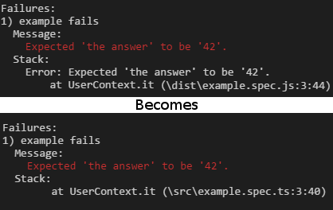

# Jasmine Typescript Console Reporter

[](https://www.npmjs.com/package/jasmine-ts-console-reporter)
[](https://github.com/SeanSobey/JasmineTSConsoleReporter/issues)
[](https://github.com/SeanSobey/JasmineTSConsoleReporter/blob/master/LICENSE)

A [Jasmine](https://jasmine.github.io/) Console Reporter that remaps Typescript files. This will use source maps to remap the error stack file paths and line numbers to the source typescript files.

## Preview



## Installation

`npm i jasmine-ts-console-reporter`

## Usage

Create a helper file for jasmine, eg specs/helpers.js

```js
const TSConsoleReporter = require('jasmine-ts-console-reporter');

jasmine.getEnv().clearReporters(); // Clear default console reporter
jasmine.getEnv().addReporter(new TSConsoleReporter());
```

### Custom sourceMapProvider

For more intricate usage scenarios, like using [istanbul](https://github.com/gotwarlost/istanbul) where the sourcemaps for instumented files are held in memory, you can locate the sourcemaps via a callback:

```js
new TSConsoleReporter({
	sourceMapProvider: (fileName) => {
		const map = fetchMySourceMap(fileName);
		return map ? { map } : null;	// Return null if no source map is found.
	}
});
```

### Custom stack filter

You can provide additional filtering for the stack trace (in addition to the built in exclusion of jasmine sources), this is useful for when you are using test frameworks that show up in the stack trace like [typemoq](https://github.com/florinn/typemoq).

```js
// regexp
new TSConsoleReporter({
	filter: /^c:\/.*$/
});
// or glob
new TSConsoleReporter({
	filter: '**/ignored/**/*.ts'
});
```

Load the helper file in Jasmine, eg on node jasmine.json:

```json
{
	"helpers": [
		"specs/helpers.js",
	]
}
```